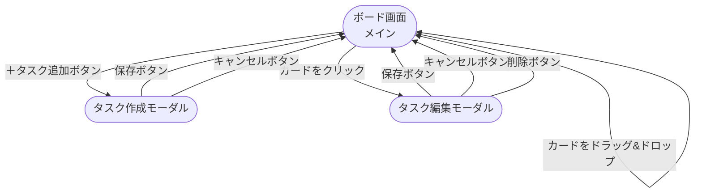

# タスク管理アプリ 要件定義書

## 1. アプリ概要

| 項目 | 内容 |
|------|------|
| アプリ名 | タスク管理アプリ（Trello風） |
| 目的 | 自分のタスクを「未着手・進行中・完了」の3段階で視覚的に管理する |
| 対象ユーザー | 個人でタスクを管理したい人 |

### プロジェクト背景

| 項目 | 内容 |
|------|------|
| 背景 | RaiseTechのWebアプリ開発コースにおける学習成果物として作成。React（フロントエンド）とJava Spring Boot（バックエンド）の習得を目的としたポートフォリオ用アプリ。 |
| 学習目標 | Reactによるコンポーネント設計・状態管理と、Spring BootによるREST API開発・データベース連携を経験し、フルスタック開発の基礎を習得する。 |

---

## 2. 画面構成

| 画面 | 説明 |
|------|------|
| ボード画面（メイン） | タスクカードを3列（未着手・進行中・完了）に並べて表示するメイン画面 |
| タスク作成モーダル | タスクの新規作成・編集に使うポップアップウィンドウ |

---

## 3. タスクのデータ項目

各タスクが持つ情報です。

| 項目名 | 説明 | 必須 |
|--------|------|------|
| タイトル | タスクの名前（例：「資料作成」） | 必須 |
| 説明文 | タスクの詳細メモ | 任意 |
| 優先度 | 高・中・低の3段階 | 必須 |
| 期限 | 完了させたい日付 | 任意 |
| ステータス | 未着手・進行中・完了（カラムの位置と連動） | 自動 |

---

## 4. データ定義

> **このセクションは何のためにあるの？**  
> フロントエンド（React）とバックエンド（Spring Boot）の間でやり取りするデータの形式、  
> データベースのテーブル構造、APIのエンドポイントを定義する設計図です。

---

### 4-1. タスクオブジェクトの構造定義（APIのJSON形式）

フロントエンドとバックエンドの間でやり取りするタスク1件のデータ形式です。

| フィールド名 | 型 | 必須/任意 | 説明 | サンプル値 |
|---|---|---|---|---|
| `id` | number | 必須（自動・DB採番） | タスクを一意に識別するID | `1` |
| `title` | string | 必須 | タスクのタイトル | `"資料作成"` |
| `description` | string | 任意 | タスクの詳細メモ。未入力時は空文字 `""` | `"会議用のスライドを作る"` |
| `priority` | string | 必須 | 優先度。`"high"` / `"medium"` / `"low"` の3択 | `"high"` |
| `dueDate` | string \| null | 任意 | 期限日。YYYY-MM-DD形式。未設定時は `null` | `"2026-05-10"` / `null` |
| `status` | string | 必須 | ステータス。`"todo"` / `"in-progress"` / `"done"` の3択 | `"todo"` |
| `createdAt` | string | 必須（自動） | 作成日時。ISO 8601形式で自動セット | `"2026-05-04T09:00:00"` |
| `updatedAt` | string | 必須（自動） | 最終更新日時。編集のたびに自動更新 | `"2026-05-04T10:30:00"` |

**APIレスポンスのサンプルJSON:**

```json
{
  "id": 1,
  "title": "資料作成",
  "description": "会議用のスライドを作る",
  "priority": "high",
  "dueDate": "2026-05-10",
  "status": "todo",
  "createdAt": "2026-05-04T09:00:00",
  "updatedAt": "2026-05-04T10:30:00"
}
```

---

### 4-2. 選択肢の定義（列挙値）

`priority` と `status` は決まった値しか使えません。

**優先度（priority）**

| 保存する値 | 画面表示ラベル | 意味 |
|---|---|---|
| `"high"` | 高 | 急ぎ・重要なタスク |
| `"medium"` | 中 | 通常のタスク |
| `"low"` | 低 | 急がないタスク |

**ステータス（status）**

| 保存する値 | 画面表示ラベル | 対応するカラム |
|---|---|---|
| `"todo"` | 未着手 | 「未着手」カラム |
| `"in-progress"` | 進行中 | 「進行中」カラム |
| `"done"` | 完了 | 「完了」カラム |

---

### 4-3. DBテーブル定義（tasks テーブル）

MySQLに作成するテーブルの構造です。シングルユーザー前提のため、ユーザー管理テーブルは持ちません。

| カラム名 | 型 | 制約 | 説明 |
|---|---|---|---|
| `id` | BIGINT | PRIMARY KEY, AUTO_INCREMENT | タスクID（自動採番） |
| `title` | VARCHAR(50) | NOT NULL | タイトル |
| `description` | VARCHAR(200) | NULL可 | 説明文 |
| `priority` | VARCHAR(10) | NOT NULL | high / medium / low |
| `due_date` | DATE | NULL可 | 期限 |
| `status` | VARCHAR(20) | NOT NULL | todo / in-progress / done |
| `created_at` | DATETIME | NOT NULL | 作成日時（自動） |
| `updated_at` | DATETIME | NOT NULL | 更新日時（自動） |

---

### 4-4. REST API エンドポイント一覧

フロントエンド（React）がバックエンド（Spring Boot）に送るリクエストの一覧です。

| メソッド | パス | 説明 |
|---|---|---|
| GET | `/api/tasks` | タスク一覧取得 |
| POST | `/api/tasks` | タスク新規作成 |
| PUT | `/api/tasks/{id}` | タスク更新（内容・ステータス変更） |
| DELETE | `/api/tasks/{id}` | タスク削除 |

---

### 4-5. バリデーションルール

フォームに入力された値が正しいかチェックするルールです。

| フィールド名 | ルール | エラーメッセージ例 |
|---|---|---|
| `title` | 必須。1文字以上50文字以内。空白のみはNG | 「タイトルを入力してください」 |
| `description` | 任意。入力する場合は200文字以内 | 「説明文は200文字以内で入力してください」 |
| `priority` | 必須。`"high"` / `"medium"` / `"low"` のいずれか | 「優先度を選択してください」 |
| `dueDate` | 任意。入力する場合はYYYY-MM-DD形式 | 「正しい日付を入力してください」 |

---

## 5. 機能一覧

### 基本操作（CRUD）

| 機能 | 説明 |
|------|------|
| タスク作成 | ボタンを押してタスクを新規追加する |
| タスク表示 | タスクをカード形式で一覧表示する |
| タスク編集 | カードをクリックしてタイトル・説明文・優先度・期限を変更する |
| タスク削除 | カード上の削除ボタンでタスクを消す |

### ステータス管理

| 機能 | 説明 |
|------|------|
| 3列カンバンボード | 「未着手」「進行中」「完了」の3つのカラムを表示する |
| カードのドラッグ＆ドロップ | カードをつかんで別のカラムに移動できる |

### データ保存

| 機能 | 説明 |
|------|------|
| API通信 | ReactからREST APIを呼び出し、Spring Boot経由でMySQLにデータを保存・取得する |
| データ永続化 | ブラウザを閉じても次回開いたときにタスクが残っている |

---

## 6. 技術スタック（使用技術）

| 役割 | 技術 | 理由 |
|------|------|------|
| フロントエンド | React | コンポーネント設計・状態管理の学習 |
| バックエンド | Java / Spring Boot | REST API開発・サーバーサイド処理の学習 |
| データベース | MySQL | データの永続化。Spring Boot（JPA）と連携 |
| API通信 | REST API（JSON） | フロントエンドとバックエンドのデータのやり取り |

---

## 7. 今回は作らないもの（対象外）

- ログイン・ユーザー登録機能
- 複数人での共有・共同編集
- スマートフォン向けの最適化

---

## 8. 画面遷移図



---

## 9. 画面仕様（ワイヤーフレーム）

### 9-1. ボード画面（メイン）

```
┌──────────────────────────────────────────────────────────────┐
│  タスク管理アプリ                         [＋ タスク追加]     │
├────────────────────┬──────────────────────┬───────────────────┤
│      未着手         │       進行中           │      完了         │
│                    │                      │                   │
│  ┌──────────────┐  │  ┌────────────────┐  │  ┌─────────────┐  │
│  │ タスクA       │  │  │ タスクC         │  │  │ タスクE      │  │
│  │ 優先度: 🔴 高 │  │  │ 優先度: 🟡 中   │  │  │ 優先度: 🟢低 │  │
│  │ 期限: 5/10   │  │  │ 期限: 5/15     │  │  │ 期限: 4/30  │  │
│  │          [🗑] │  │  │           [🗑] │  │  │        [🗑] │  │
│  └──────────────┘  │  └────────────────┘  │  └─────────────┘  │
│                    │                      │                   │
│  ┌──────────────┐  │                      │                   │
│  │ タスクB       │  │                      │                   │
│  │ 優先度: 🟢 低 │  │                      │                   │
│  │ 期限: なし    │  │                      │                   │
│  │          [🗑] │  │                      │                   │
│  └──────────────┘  │                      │                   │
└────────────────────┴──────────────────────┴───────────────────┘
```

| 要素 | 説明 |
|---|---|
| ＋タスク追加ボタン | クリックするとタスク作成モーダルを開く |
| タスクカード | タイトル・優先度・期限を表示。クリックで編集モーダルを開く |
| 🗑 削除ボタン | カード右下に配置。クリックでタスクを即時削除する |
| カラム | 未着手・進行中・完了の3列。カードをドラッグ&ドロップで移動可能 |

---

### 9-2. タスク作成モーダル

```
┌──────────────────────────────────────┐
│  タスクを追加                    [✕]  │
├──────────────────────────────────────┤
│                                      │
│  タイトル *                           │
│  ┌────────────────────────────────┐  │
│  │ タスクのタイトルを入力          │  │
│  └────────────────────────────────┘  │
│                                      │
│  説明文                               │
│  ┌────────────────────────────────┐  │
│  │                                │  │
│  │ 詳細メモを入力（任意）          │  │
│  │                                │  │
│  └────────────────────────────────┘  │
│                                      │
│  優先度 *              期限           │
│  ┌────────────────┐  ┌────────────┐  │
│  │ 高 ▼           │  │ YYYY-MM-DD │  │
│  └────────────────┘  └────────────┘  │
│                                      │
│           [キャンセル]  [保存する]     │
└──────────────────────────────────────┘
```

| 要素 | 説明 |
|---|---|
| タイトル（必須） | テキスト入力欄。1〜50文字 |
| 説明文（任意） | テキストエリア。最大200文字 |
| 優先度（必須） | ドロップダウン選択。高・中・低 |
| 期限（任意） | 日付ピッカー。YYYY-MM-DD形式 |
| 保存するボタン | バリデーション通過後にAPIへPOSTリクエストを送信 |
| キャンセル / ✕ | 入力内容を破棄してモーダルを閉じる |

---

### 9-3. タスク編集モーダル

```
┌──────────────────────────────────────┐
│  タスクを編集                    [✕]  │
├──────────────────────────────────────┤
│                                      │
│  タイトル *                           │
│  ┌────────────────────────────────┐  │
│  │ 資料作成                        │  │
│  └────────────────────────────────┘  │
│                                      │
│  説明文                               │
│  ┌────────────────────────────────┐  │
│  │                                │  │
│  │ 会議用のスライドを作る          │  │
│  │                                │  │
│  └────────────────────────────────┘  │
│                                      │
│  優先度 *              期限           │
│  ┌────────────────┐  ┌────────────┐  │
│  │ 高 ▼           │  │ 2026-05-10 │  │
│  └────────────────┘  └────────────┘  │
│                                      │
│  [削除する]   [キャンセル]  [保存する]  │
└──────────────────────────────────────┘
```

| 要素 | 説明 |
|---|---|
| 各入力欄 | 既存のタスクデータが初期値として表示される |
| 保存するボタン | バリデーション通過後にAPIへPUTリクエストを送信 |
| 削除するボタン | APIへDELETEリクエストを送信してタスクを削除。モーダルを閉じる |
| キャンセル / ✕ | 変更を破棄してモーダルを閉じる |

---

## 10. 非機能要件

### 10-1. 対応環境

| 項目 | 内容 |
|---|---|
| 対応ブラウザ | Google Chrome 最新版のみ |
| 対応デバイス | デスクトップPC（スマートフォン・タブレットは対象外） |
| 最小画面幅 | 1280px |

### 10-2. パフォーマンス

| 項目 | 目標値 |
|---|---|
| 画面初期表示 | 3秒以内 |
| API応答時間 | 1秒以内 |

### 10-3. セキュリティ

| 項目 | 対策 |
|---|---|
| XSS対策 | ReactのデフォルトのエスケープによりXSSを防ぐ |
| 入力値バリデーション | フロントエンド（React）とバックエンド（Spring Boot）の両方でチェックする |

### 10-4. 可用性・保守性

| 項目 | 内容 |
|---|---|
| 可用性 | 学習・開発環境用のため、稼働率の保証（SLA）なし |
| 保守性（フロントエンド） | Reactコンポーネントを機能単位で分割して管理する |
| 保守性（バックエンド） | Spring BootのController / Service / Repositoryのレイヤー構成で分割する |
