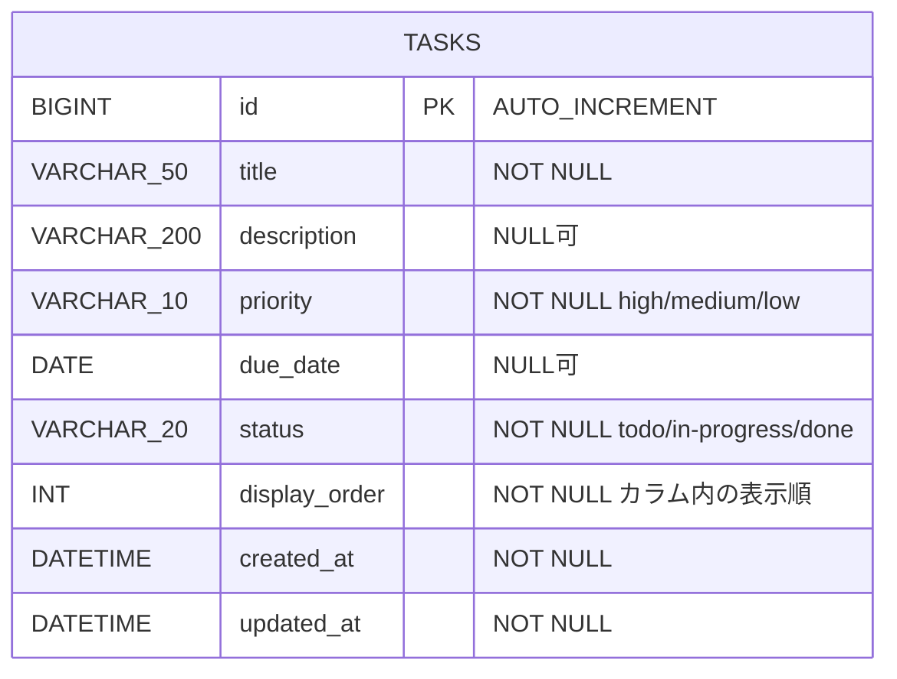

[← README に戻る](../README.md)

# データ定義

> フロントエンド（React）とバックエンド（Spring Boot）の間でやり取りするデータの形式、データベースのテーブル構造、APIのエンドポイントを定義する設計図です。

---

## ER図

シングルユーザー前提のため、テーブルは `tasks` の1つのみです。



---

## タスクのデータ項目

各タスクが持つ情報です。

| 項目名 | 説明 | 必須 |
|--------|------|------|
| タイトル | タスクの名前（例：「資料作成」） | 必須 |
| 説明文 | タスクの詳細メモ | 任意 |
| 優先度 | 高・中・低の3段階 | 必須 |
| 期限 | 完了させたい日付 | 任意 |
| ステータス | 未着手・進行中・完了（カラムの位置と連動） | 自動 |
| 表示順 | 同じカラム内でのカードの並び順（手動並び替え・ソート操作で更新） | 自動 |

---

## タスクオブジェクトの構造定義（APIのJSON形式）

フロントエンドとバックエンドの間でやり取りするタスク1件のデータ形式です。

| フィールド名 | 型 | 必須/任意 | 説明 | サンプル値 |
|---|---|---|---|---|
| `id` | number | 必須（自動・DB採番） | タスクを一意に識別するID | `1` |
| `title` | string | 必須 | タスクのタイトル | `"資料作成"` |
| `description` | string | 任意 | タスクの詳細メモ。未入力時は空文字 `""` | `"会議用のスライドを作る"` |
| `priority` | string | 必須 | 優先度。`"high"` / `"medium"` / `"low"` の3択 | `"high"` |
| `dueDate` | string \| null | 任意 | 期限日。YYYY-MM-DD形式。未設定時は `null` | `"2026-05-10"` / `null` |
| `status` | string | 必須 | ステータス。`"todo"` / `"in-progress"` / `"done"` の3択 | `"todo"` |
| `displayOrder` | number | 必須（自動） | 同じカラム内での表示順（小さいほど上）。手動並び替え・ソート操作で更新 | `0` |
| `createdAt` | string | 必須（自動） | 作成日時。ISO 8601形式で自動セット | `"2026-05-04T09:00:00"` |
| `updatedAt` | string | 必須（自動） | 最終更新日時。編集のたびに自動更新 | `"2026-05-04T10:30:00"` |

**APIレスポンスのサンプルJSON:**

```json
{
  "id": 1,
  "title": "資料作成",
  "description": "会議用のスライドを作る",
  "priority": "high",
  "dueDate": "2026-05-10",
  "status": "todo",
  "displayOrder": 0,
  "createdAt": "2026-05-04T09:00:00",
  "updatedAt": "2026-05-04T10:30:00"
}
```

---

## 選択肢の定義（列挙値）

`priority` と `status` は決まった値しか使えません。

**優先度（priority）**

| 保存する値 | 画面表示ラベル | 意味 |
|---|---|---|
| `"high"` | 高 | 急ぎ・重要なタスク |
| `"medium"` | 中 | 通常のタスク |
| `"low"` | 低 | 急がないタスク |

**ステータス（status）**

| 保存する値 | 画面表示ラベル | 対応するカラム |
|---|---|---|
| `"todo"` | 未着手 | 「未着手」カラム |
| `"in-progress"` | 進行中 | 「進行中」カラム |
| `"done"` | 完了 | 「完了」カラム |

---

## DBテーブル定義（tasks テーブル）

PostgreSQLに作成するテーブルの構造です。シングルユーザー前提のため、ユーザー管理テーブルは持ちません。

| カラム名 | 型 | 制約 | 説明 |
|---|---|---|---|
| `id` | BIGSERIAL | PRIMARY KEY | タスクID（自動採番） |
| `title` | VARCHAR(50) | NOT NULL | タイトル |
| `description` | VARCHAR(200) | NULL可 | 説明文 |
| `priority` | VARCHAR(10) | NOT NULL | high / medium / low |
| `due_date` | DATE | NULL可 | 期限 |
| `status` | VARCHAR(20) | NOT NULL | todo / in-progress / done |
| `display_order` | INT | NOT NULL | 同一 status 内での表示順（小さいほど上） |
| `created_at` | TIMESTAMP | NOT NULL | 作成日時（自動） |
| `updated_at` | TIMESTAMP | NOT NULL | 更新日時（自動） |

---

## REST API エンドポイント一覧

フロントエンド（React）がバックエンド（Spring Boot）に送るリクエストの一覧です。

| メソッド | パス | 説明 |
|---|---|---|
| GET | `/api/tasks` | タスク一覧取得（`status` ごとに `display_order` 昇順で返す） |
| POST | `/api/tasks` | タスク新規作成 |
| PUT | `/api/tasks/{id}` | タスク更新（タイトル・説明・優先度・期限を変更）。ステータス・表示順の変更は `PATCH /api/tasks/reorder` を使う |
| DELETE | `/api/tasks/{id}` | タスク削除 |
| PATCH | `/api/tasks/reorder` | カラム内手動並び替え / ソート操作に伴う複数タスクの `status` / `displayOrder` を一括更新（204 No Content） |

**PATCH /api/tasks/reorder のリクエスト形式:**

```json
{
  "items": [
    { "id": 1, "status": "todo", "displayOrder": 0 },
    { "id": 2, "status": "todo", "displayOrder": 1 }
  ]
}
```

> カラム内の手動並び替えやソート時、および別カラムへのドラッグ＆ドロップに伴うステータス変更は、影響を受ける複数タスクを `PATCH /api/tasks/reorder` で一括更新する。

---

## バリデーションルール

フォームに入力された値が正しいかチェックするルールです。

| フィールド名 | ルール | エラーメッセージ例 |
|---|---|---|
| `title` | 必須。1文字以上50文字以内。空白のみはNG | 「タイトルを入力してください」 |
| `description` | 任意。入力する場合は200文字以内 | 「説明文は200文字以内で入力してください」 |
| `priority` | 必須。`"high"` / `"medium"` / `"low"` のいずれか | 「優先度を選択してください」 |
| `dueDate` | 任意。入力する場合はYYYY-MM-DD形式 | 「正しい日付を入力してください」 |
