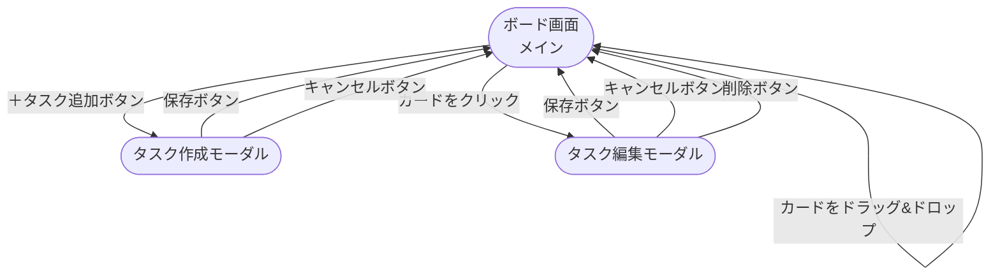

[← README に戻る](../README.md)

# 画面設計

## 画面一覧

| 画面名 | URL（パス） | 種別 | 概要 |
|---|---|---|---|
| ボード画面 | `/` | ページ | カンバン形式でタスクを一覧表示するメイン画面 |
| タスク作成モーダル | `/`（重ねて表示） | モーダル | 新規タスクを入力・登録するポップアップ |
| タスク編集モーダル | `/`（重ねて表示） | モーダル | 既存タスクを編集・削除するポップアップ |

> モーダルはURLが変わらず、ボード画面の上に重ねて表示される。

---

## ボード画面（メイン）

| 項目 | 内容 |
|---|---|
| 表示タイミング | アプリ起動時に常に表示 |
| 主要コンポーネント（React） | `BoardPage`、`Column`（×3）、`TaskCard`、`Header` |
| 主な操作 | タスク追加ボタン押下 / カードクリック / カードのドラッグ&ドロップ |

```
┌──────────────────────────────────────────────────────────────┐
│  タスク管理アプリ                         [＋ タスク追加]     │
├────────────────────┬──────────────────────┬───────────────────┤
│      未着手         │       進行中           │      完了         │
│                    │                      │                   │
│  ┌──────────────┐  │  ┌────────────────┐  │  ┌─────────────┐  │
│  │ タスクA       │  │  │ タスクC         │  │  │ タスクE      │  │
│  │ 優先度: 🔴 高 │  │  │ 優先度: 🟡 中   │  │  │ 優先度: 🟢低 │  │
│  │ 期限: 5/10   │  │  │ 期限: 5/15     │  │  │ 期限: 4/30  │  │
│  │          [🗑] │  │  │           [🗑] │  │  │        [🗑] │  │
│  └──────────────┘  │  └────────────────┘  │  └─────────────┘  │
│                    │                      │                   │
│  ┌──────────────┐  │                      │                   │
│  │ タスクB       │  │                      │                   │
│  │ 優先度: 🟢 低 │  │                      │                   │
│  │ 期限: なし    │  │                      │                   │
│  │          [🗑] │  │                      │                   │
│  └──────────────┘  │                      │                   │
└────────────────────┴──────────────────────┴───────────────────┘
```

| 要素 | 説明 |
|---|---|
| ＋タスク追加ボタン | クリックするとタスク作成モーダルを開く |
| タスクカード | タイトル・優先度・期限を表示。クリックで編集モーダルを開く |
| 🗑 削除ボタン | カード右下に配置。クリックでタスクを即時削除する |
| カラム | 未着手・進行中・完了の3列。カードをドラッグ&ドロップで移動可能 |

---

## タスク作成モーダル

| 項目 | 内容 |
|---|---|
| 表示タイミング | ボード画面で「＋タスク追加」ボタンを押したとき |
| 主要コンポーネント（React） | `TaskModal`、`TaskForm` |
| 主な操作 | 入力 → 保存（POST） / キャンセル |

```
┌──────────────────────────────────────┐
│  タスクを追加                    [✕]  │
├──────────────────────────────────────┤
│                                      │
│  タイトル *                           │
│  ┌────────────────────────────────┐  │
│  │ タスクのタイトルを入力          │  │
│  └────────────────────────────────┘  │
│                                      │
│  説明文                               │
│  ┌────────────────────────────────┐  │
│  │                                │  │
│  │ 詳細メモを入力（任意）          │  │
│  │                                │  │
│  └────────────────────────────────┘  │
│                                      │
│  優先度 *              期限           │
│  ┌────────────────┐  ┌────────────┐  │
│  │ 高 ▼           │  │ YYYY-MM-DD │  │
│  └────────────────┘  └────────────┘  │
│                                      │
│           [キャンセル]  [保存する]     │
└──────────────────────────────────────┘
```

| 要素 | 説明 |
|---|---|
| タイトル（必須） | テキスト入力欄。1〜50文字 |
| 説明文（任意） | テキストエリア。最大200文字 |
| 優先度（必須） | ドロップダウン選択。高・中・低 |
| 期限（任意） | 日付ピッカー。YYYY-MM-DD形式 |
| 保存するボタン | バリデーション通過後にAPIへPOSTリクエストを送信 |
| キャンセル / ✕ | 入力内容を破棄してモーダルを閉じる |

---

## タスク編集モーダル

| 項目 | 内容 |
|---|---|
| 表示タイミング | ボード画面でタスクカードをクリックしたとき |
| 主要コンポーネント（React） | `TaskModal`、`TaskForm` |
| 主な操作 | 編集 → 保存（PUT） / 削除（DELETE） / キャンセル |

```
┌──────────────────────────────────────┐
│  タスクを編集                    [✕]  │
├──────────────────────────────────────┤
│                                      │
│  タイトル *                           │
│  ┌────────────────────────────────┐  │
│  │ 資料作成                        │  │
│  └────────────────────────────────┘  │
│                                      │
│  説明文                               │
│  ┌────────────────────────────────┐  │
│  │                                │  │
│  │ 会議用のスライドを作る          │  │
│  │                                │  │
│  └────────────────────────────────┘  │
│                                      │
│  優先度 *              期限           │
│  ┌────────────────┐  ┌────────────┐  │
│  │ 高 ▼           │  │ 2026-05-10 │  │
│  └────────────────┘  └────────────┘  │
│                                      │
│  [削除する]   [キャンセル]  [保存する]  │
└──────────────────────────────────────┘
```

| 要素 | 説明 |
|---|---|
| 各入力欄 | 既存のタスクデータが初期値として表示される |
| 保存するボタン | バリデーション通過後にAPIへPUTリクエストを送信 |
| 削除するボタン | APIへDELETEリクエストを送信してタスクを削除。モーダルを閉じる |
| キャンセル / ✕ | 変更を破棄してモーダルを閉じる |

> タスク作成・編集モーダルは同じ `TaskModal` コンポーネントを使い回す。新規作成か編集かは props で切り替える設計とする。

---

## 画面遷移図


